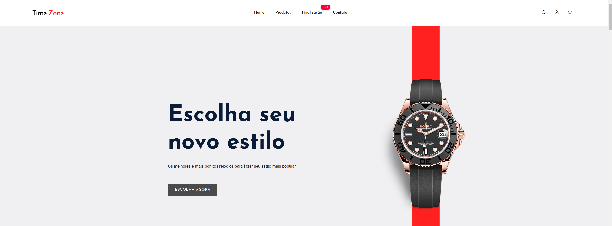
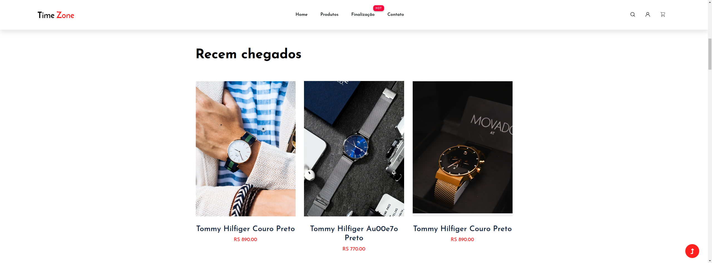
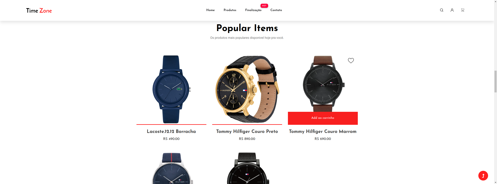
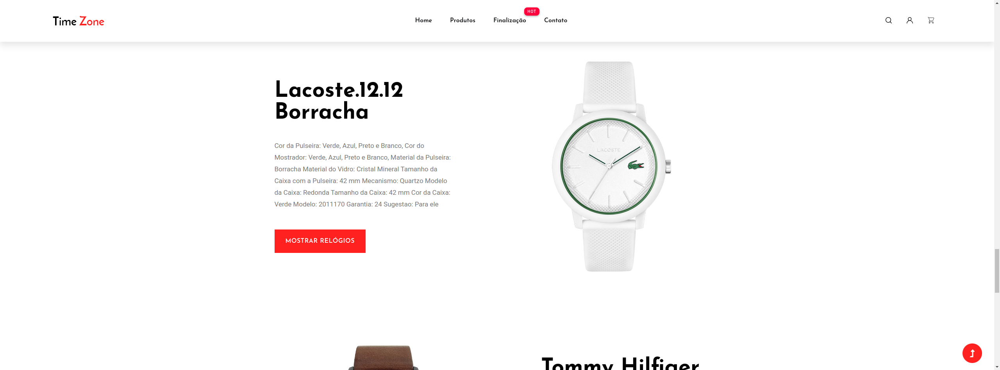
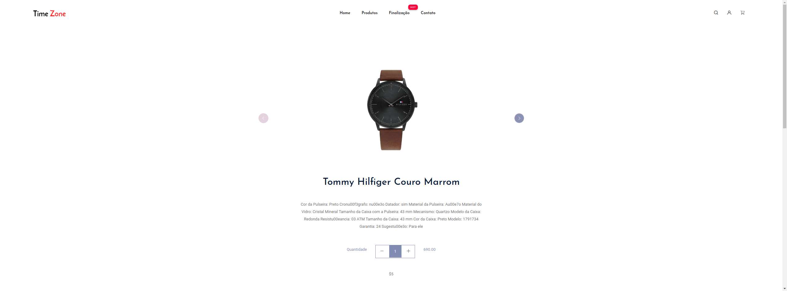
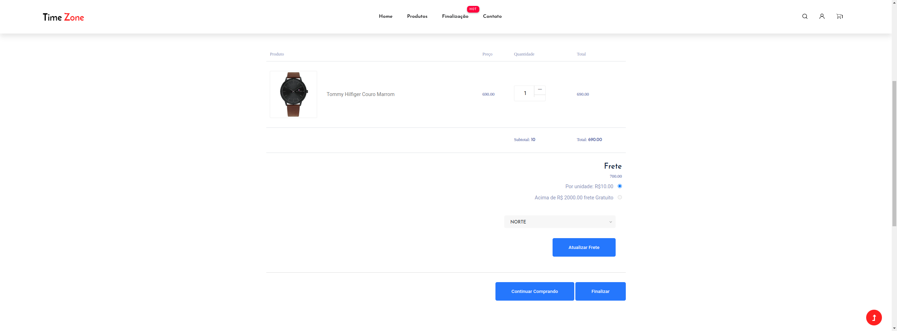
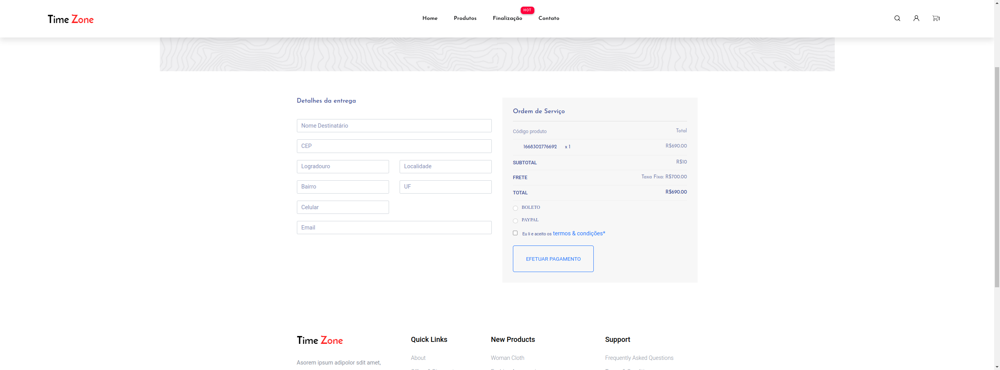
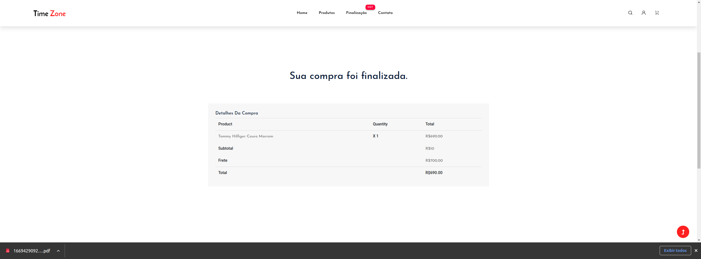
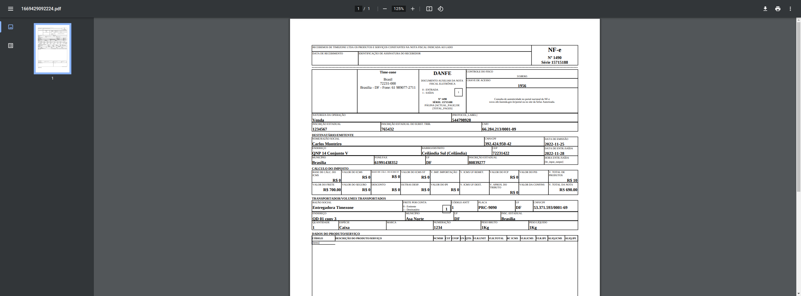

# Ecommerce Time-zone
Projeto consiste em um ecommerce de venda de relógios, que adiciona itens ao carrinho, soma o frete, realiza o checkout e após a finalização gera uma Nf fiquitícia com os dados da compra:

obs: O projeto tem é um ecommerce fake, que tem o propósito apenas de ser util com portifólio.

Algumas regras de negócios inseridas:

 * A cada produto adicionado no carrinho, é adicionado o valor de R$ 10,00 a mais no Frete.
 * Caso a soma dos produtos adicionados no carrinho chegue a R$ 3000,00 a venda recebe o frete GRATUITO.
 * Caso a Região do usuário seja a CENTRO-OESTE o FRETE também será gratuito.

 # Tecnologias e ferramentas usadas
 * Spring boot - Framework utilizada com a arquitetura MVC.
 * Lombok - para Gerar os construtores e os métodos Getter e Setter no projeto..
 * Spring-boot-devtools - Pela facilidade no reload ao realizar uma modificação.
 * JUnit 5 - para testes unitários.
 * Java 11 - usado no código fonte.
 * thymeleaf - para a construção das telas com atributos dinâmicos.
 * ModelMapper - para realizar o parse do objeto serealizado para um objeto não serealizado.
 * As bibliotecas org.xhtmlrenderer e org.jsoup para gerar um arquivo PDF a partir de um modelo HTML.
 * Spring data JPA - para o uso na stratégia de persistência.
 * Mysql 8 - utilizado como banco de dados.

# Banco utilizado é o Mysql 8
Foi utilizado o banco de dados Mysql 8 para a fase de desenvolvimento.

Antes do projeto ser execultado deve-se, na raiz do projeto, execultar o comando "docker-compose up -d" para baixar uma instância do Mysql 8, depois disso, connect o banco com os dados a baixo
e execulte a importação do arquivo "dump.sql" para realizar a carga dos dados no banco. 

## dados de acesso:
* JDBC URL: jdbc:mysql://localhost:3306/timezone?createDatabaseIfNotExist=true&serverTimezone=UTC
* User: root
* Password: root

Obs: é necessário que possua docker instalado.

# Executando o projeto

## Existe duas formas de execultar o projeto: 
* Com o código fonte, neste é necessário executar o arquivo "TimeZoneApplicationApplication.java", como "Java application" ou executando o comando mvn spring-boot:run
* Via docker, na raiz do projeto, abra o terminal e execulte o build da imagem com o comando "docker build time-zone",
 depois do build execultar o comando "docker run -itd --name time-zone -p 8080:8080 time-zone".

 Após a execução do projeto, pode ser acessado na url http://localhost:8080/

Obs: para a segunda forma, é necessário o docker instalado na máquina.

# Telas do projeto 

* Home parte 1

  

* Home parte 2

  

* Home parte 3

  

* Home parte 4

  

* Detalhe do produto

  

* Carrinho de compras

  

* Checkout

  

* Confirmação da compra

  

* Nota fiscal gerada pelo sistema 

  

